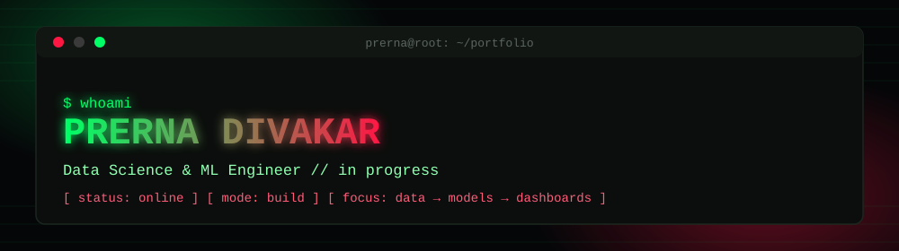

<div align="center">
  
</div>

<p align="center">
  
</p>

<p align="center">
  <a href="https://www.linkedin.com/in/prerna-d-130045283"></a>
  
  
  
</p>


## `>_` about

```
root@prerna:~$ cat profile.log

Data Science / ML Engineer in progress.
I take raw, messy datasets and push them through a full pipeline —
clean → model → serve → visualize — until they're something a
person can actually make a decision from.

CURRENT FOCUS   : ML-driven analytics tools + the apps around them
LEARNING        : statistical testing, transformers, ML in the cloud
STACK           : Python · Django · React · SQL · PostgreSQL · Power BI
CONTACT         : linkedin.com/in/prerna-d-130045283
```


## `>_` deployed builds

```
[ExperimentX]              STATUS: LIVE       LANG: JavaScript
> AI-powered A/B testing platform. Deterministic variant assignment,
  conversion tracking, and both Bayesian + frequentist significance
  testing — so results don't hinge on a single p-value.

[DRRAS]                    STATUS: LIVE       LANG: Python
> Disaster Relief Resource Allocation System — real-time + historical
  data feeding ML-based disaster prediction, built to route relief
  resources across Maharashtra before need spikes, not after.

[CYBERDELAY]                STATUS: LIVE       LANG: HTML
> Simulation modeling how breach-detection delay compounds damage —
  turns "how fast did you notice" into a quantified risk curve.

[SCI-ARTICLE-CLASSIFIER]    STATUS: LIVE       LANG: Python
> Self-attention network vs. TF-IDF baseline for scientific article
  classification, benchmarked head-to-head with an interactive
  Streamlit dashboard.
```

<div align="center">

<a href="https://github.com/Prernadivakar03/ExperimentX">
  
</a>
<a href="https://github.com/Prernadivakar03/DRRAS">
  
</a>
<br/>
<a href="https://github.com/Prernadivakar03/cyberdelay">
  
</a>
<a href="https://github.com/Prernadivakar03/sci-article-classifier">
  
</a>

</div>


## `>_` stack

<div align="center">


<br/><br/>


<br/><br/>


</div>


## `>_` system analytics

<div align="center">


</div>

### `>_` trophy case

<div align="center">

</div>


<p align="center" style="font-family: Courier New, monospace;">
<code>$ echo "open to internships & collabs — bring a dataset, I'll bring the pipeline"</code>
</p>
